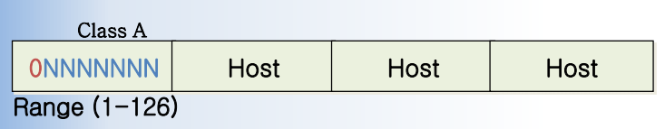
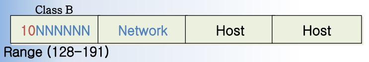
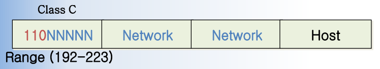
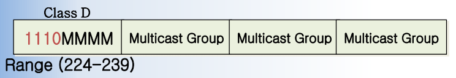
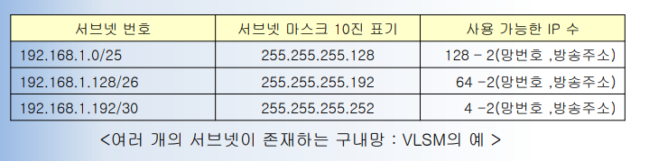
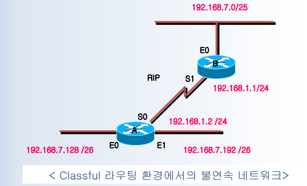

# __인터넷 주소기법__
### Domain Name
- 응용 계층에서 사용하는 컴퓨터 식별 주소
- 호스트 시스템이나 망의 일부분을 식별하기 위한 인터넷 주소 지정 단위
- 예시 : ftp.kut.ac.kr, www.kut.ac.kr

### URL(Uniform Resource Locator)
- 인터넷 상의 각종 자원의 위치를 표시하는 주소
- WWW 응용 서비스에서 사용
- 예시 : http://www.kut.ac.kr

### IP 주소
- __32비트__ 주소
- __3 계층__ IP 프로토콜에서 사용
- 예시 : 203.255.221.2

### MAC 주소
- __48비트__ LAN카드 식변번호
- __1,2 계층__ 에서 사용하는 하드웨어 주소
- 예시 : fa:12:23:56:77:03

### Port 번호
- __16비트__ 응용 서비스 식별 번호
- __4 계층__ 에서 사용
- TCP 와 UDP 프로토콜에서 사용
- 예시 : HTTP(80), Telnet(23), SMTP(25)

### Protocol 번호
- __8비트__ 상위계층 프로토콜 식별자 번호
- __3 계층__ 에서 사용
- 예시 : TCP(6), UDP(17)

### Ethernet Type 번호
- __16비트__ LAN 상위계층 프로토콜 식별 번호
- __1,2 계층__ 에서 사용
- Ethernet LAN 프로토콜에서 사용
- 예시 : IP : 0x0800, ARP : 0x0806

---

# __IP 주소 종류__
## Classful
### Class A

- 네트워크 비트 : 8비트
- 호스트 비트 : 24비트
- __첫 비트를 0 으로 고정__
- 범위 : 1.0.0.0 ~ 126.255.255.255

### Class B

- 네트워크 비트 : 16비트
- 호스트 비트 : 16비트
- __처음 두 비트를 10 으로 고정__
- 범위 : 128.0.0.0 ~ 191.255.255.255

### Class C

- 네트워크 비트 : 32비트
- 호스트 비트 : 8비트
- __처음 세 비트를 110 으로 고정__
- 범위 : 192.0.0.0 ~ 223.255.255.255

### Class D

- __멀티캐스트__ 용도로 사용되는 주소
- 범위 : 224.0.0.0 ~ 239.255.255.255

### Class E
- 특수 용도로 사용되는 주소

## Classless
- Subnet 기법을 이용한 서브 클래스 개념
- Subnet 은 망의 수요에 따라 IP 주소를 적절하게 할당하여 IP 주소의 낭비를 막아준다.

### VLSM (Variable Length Subnet Mask)
- 구내망 내에 여러 개의 서브넷이 존재하며, 각 __서브넷의 서브넷 마스크 크기가 서로 다르게 구성될 수 있는 가변 서브넷 설계 기술__

- Classful 라우팅 프로토콜인 RIP, IGRP 는 VLSM 을 지원하지 않는다.
- __불연속 네트워크(Discontiguous Network)__ 와 VLSM
  - 불연속 네트워크(불연속 서브넷) : 완전히 상이한 네트워크 또는 서브넷에 의해 구분되어지는 같은 메이저 네트워크의 서브넷
  - 불연속 네트워크의 문제점 : 클래스 기반 라우팅 프로토콜들(RIPv1, IGRP)은 서브넷 마스크가 라우팅 업데이트에 포함되지 않으므로 불연속 서브넷을 지원할 수 없다.
  

---

# __Subnet__
### Subnet
- 하나의 네트워크를 분리하여 얻어지는 작은 네트워크들 중 하나
- 호스트 비트 중 일부를 네트워크 비트로 전환하여 만듦

### Subnet Mask
- 32비트 중에서 네트워크 비트들의 위치를 알려주는 비트열
- 네트워크 비트의 위치는 1로 표시되며, 호스트 비트의 위치는 0으로 표시
- 서브넷을 만들지 않은 경우는 네트워크마스크 라고도 하며, 이 때는 클래스별로 원래 할당된 네트워크 비트 부분만 1로 표시

### Subnet Mask 표현법
- 10진수 표현법 : __255.255.255.0__
- Prefix 표현법 : \~.\~.\~.\~ __/24__

---

# __Supernet__
- 규모가 작은 네트워크들을 합하여 새로운 커다란 네트워크를 만드는 기술
- Classless 기반 주소 지정 체계에서 이점
  - 주소의 낭비와 라우팅 테이블 크기 증가를 피할 수 있다.
  - 필요로 하는 주소 공간을 얻을 수 있다.
- Supernet 의 망번호는 __작은 네트워크들의 공통비트__ 에 의거해서 요약해야 한다.

---

