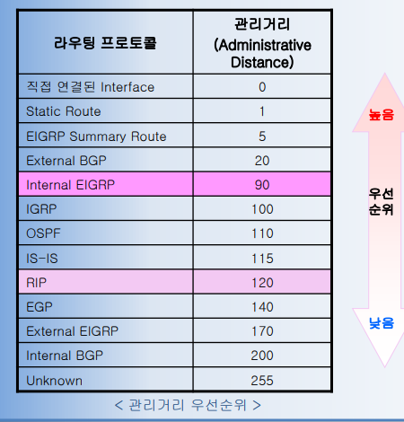

# __라우팅 프로토콜__
## 라우팅(Routing)
- 라우팅 : __정보를 목적지까지 어디로 어떻게 전송해야 가장 효율적인지 그 경로를 결정하는 행위__
- 라우터 : 최적의 경로를 설정하는 네트워크 장비
- 라우팅 프로토콜 : 라우터간, 목적지 네트워크에 대한 경로 정보를 주고 받을 때 이용되는 프로토콜

## Routing Protocol VS Routed Protocol
### Routing Protocol
- 경로를 설정하는 핵심 알고리즘을 수행하는 프로토콜
  - RIP(Routing Information Protocol)
  - IGRP/EIGRP(Enhanced Interior Gateway Routing Protocol)
  - OSPF(Open Shortest Path First)
  - BGP(Border Gateway Protocol)
  - IS-IS(Intermediate System to Intermediate System)

### Routed Protocol
- 네트워크 전반에서 경로설정 정보를 이용하여 __데이터 전달__ 을 가능하게 해주는 3계층 네트워크 프로토콜
  - TCP/IP
  - OSI CLNS
  - OSI CMNS
  - Novell IPX
  - Apple Talk

---

# 라우터(Router)
- 정보(IP 패킷)를 목적지까지 전달하는 라우팅 동작을 수행
- 라우터 간에 라우팅 정보를 교환하며 최적의 경로를 설정하고 관리
#### __최적 경로 설정과 관련된 라우터의 동작 관계__
1. __경로 정보 수집__
  최적의 경로를 탐색하기 위해 라우팅 프로토콜을 이용하여 인접한 라우터 간에 주고 받는 망 상태 정보를 수집
2. __라우팅 테이블 작성__
  각 목적지에 대한 최적의 경로를 계산하여 저장한다.
  (목적지 주소, 서브넷 마스크, 비용, 다음 홉 라우터/라우터 인터페이스)
3. __라우팅 광고__
  경로정보를 알려주는 동작으로 라우팅 프로토콜을 이용하여 경로 정보를 인접한 라우터에게 전달한다.

#### 라우터의 정보전달 절차__
1. __주소 인식__
수신한 패킷에서 __목적지 주소 부분을 탐색__
2. __라우팅 테이블 검색__
라우터의 기본 작업으로 이미 저장되어 있는 __경로값을 검색__
3. __최적 경로 설정__
여러 경로 중에서 __최적의 경로를 검색__
4. __패킷 전달__
결정된 경로로 __패킷을 전달__ 한다.

---

# 경로 결정 요소
- 라우터는 인접한 라우터로부터 전달받은 경로정보로 비용을 계산하여 최적의 경로를 결정
- 비용 계산에 미치는 요소들을 __Metric__ 이라고 한다.
  1. 홉 수(Hop Count)
  2. 대역폭(BandWidth)
  3. 지연(Delay)
  4. 신뢰도(Reliability)
  5. 부하(Load)
- 라우터는 위와 같은 경로결정 요소들의 상태를 수치로 표현하여 계산하는데, 이 값을 __비용(Cost)__ 이라 부른다.
- 일반적으로 가장 적은 비용의 경로를 __최적의 경로(Best Route)__ 로 결정한다.

### 홉 수(Hop Count)
- 하나의 홉 : 하나의 라우터를 지나가는 것
- 라우터를 지날 때마다 지연이 발생하기 때문에 라우터 수가 적은 경로, 즉 __홉수가 작은 경로로 패킷을 전달하는 것이 빠르고 안정적이다.__

### 링크(Link) 의 대역폭(BandWidth)
- __전송매체간의 전송 능력__
- 대역폭이 넓은, 즉 __전송 속도가 빠른 경로가 최적의 경로__ 이다.

### 지연(Delay)
- 패킷을 목적지로 보내기 위한 과정에서, __요구하는 작업을 수행하기까지의 시간__ 을 말한다.
- 전송 지연 시간은 네트워크 링크의 회선 속도와 각 경로당 라우터의 큐 길이, 링크의 네트워크 사용 정체, 그리고 물리적 회선의 거리 등 많은 요인들에 의해 결정된다.

### 부하(Load)
- 부하는 __회선 사용량__ 을 뜻한다.
- 라우터나 CPU의 사용량, 초당 패킷 처리량과 같은 다양한 측정에 의한 전송매체의 네트워크 자원 사용량을 나타낸다.

### 신뢰도(Reliability)
- __전송매체의 상태__ 를 뜻한다.
- 각 링크의 비트-에러율로 전송 손실이나 전송 에러에 대한 정보를 참조한다.
- 유/무선 네트워크에서 무선링크는 전송상태가 불안전하여 전송에러가 발생할 수 있고, 상대적으로 유선링크는 전송상태가 안정적이어서 전송에러가 거의 없다.

---

# 관리 거리(Administrative Distance)
- 하나의 라우터에 라우팅 프로토콜이 2개 이상 있을 때, 동일한 목적지에 대해 서로 다른 최적 경로값이 나오면 어느 경로를 우선하여 선택할지 결정하는 기준
- 0 ~ 255 사이의 값을 구분짓는다.

---

# 라우팅 프로토콜
#### 라우팅 프로토콜의 특성
1. 라우팅 프로토콜 경로설정 주체
2. 네트워크 규모 및 관리 방법
3. 지원 가능한 네트워크 프로토콜(라우티드 프로토콜) 수
4. 지원하는 경로의 수
5. 네트워크 구조에 따른 이웃간의 통신 방법
6. 알고리즘
#### 리우팅 프로토콜의 분류 기준
- 정적(Static) / 동적(Dynamic)
- 거리 벡터(Distance Vector) / 연결 상태(Link State)
- 평면(Flat) 구조 / 계층(Hierarchical) 구조
- 단일 경로(Single Path) / 다중 경로(Multi Path)
- 단일(Single) / 다중(Multi)
- 내부(Interior) / 외부(Exterior)
