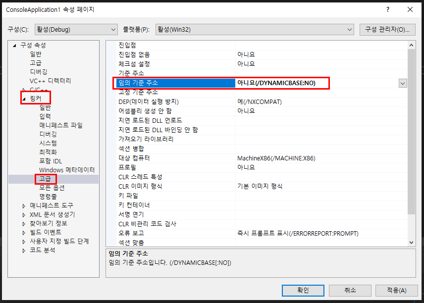
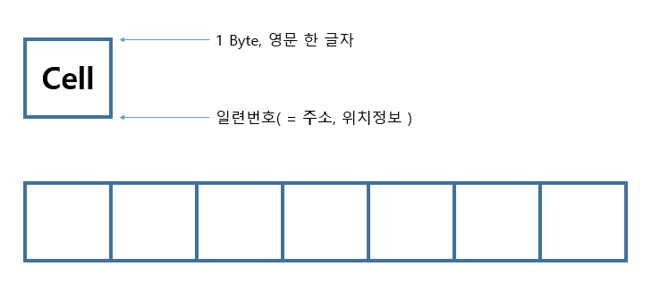

# 메모리와 포인터

#### 시작하기 전에...

구성 속성 설정에서 \[링커\] - \[고급\] - \[임의 기준 주소\] 의 설정값을 __아니오__ 로 바꾼다.
시작 주소값이 막 바뀌는 것을 방지하는 설정이다.

---

# Cell

- 메모리를 이루는 하나의 단위
- __1 Byte__ 의 크기를 가진다.
- 각 Cell 에는 일련번호가 붙어 있는데 그것을 __주소__ 라 하며 Cell 의 위치정보라 할 수 있다.
- 메모리를 할당 할 때 원하는 크기만큼의 Cell 을 __지정__ 한다. (변수를 통해 지정을 자동화하여 메모리를 사용해왔다.)
  - 직접 지정
  - 간접 지정

# Byte Order
### Little Endian
  - Intel 에서 채택한 Byte Order 방식
  - 값을 저장할 때 값을 1바이트씩 나누어 __거꾸로__ 저장하는 방식

### Big Endian

## ASLR
- Address Space Layout Randomization
- 프로그램을 실행할 때마다 메모리의 주소를 변경하여 사용한다.
- __메모리 해킹을 방지하기 위해__ 사용되기 시작했다.
- 시작하기 전에 설정했던 것이 ASLR 을 해제 시켜준다.