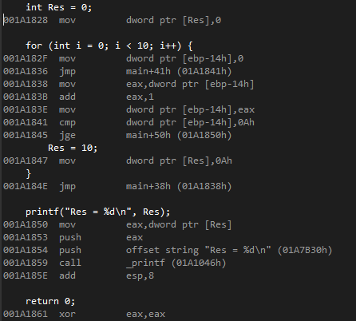
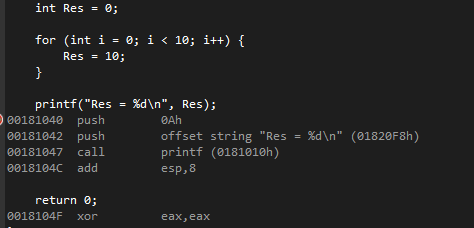

# 변수와 상수 고급 이론

---

컴파일러가 소스 코드를 __최적화__ 하기 위한 이론

## Debug vs Release

```c
#include<stdio.h>

int main(void) {
	int Res = 0;

	for (int i = 0; i < 10; i++) {
		Res = 10;
	}

	printf("Res = %d\n", Res);

	return 0;
}
```

위 코드를 이용하여 Debug 와 Release 의 차이를 알 수 있다.

### Debug 모드에서 빌드 했을 때 디스어셈블


### Release 모드에서 빌드 했을 때 디스어셈블


즉, Release 모드에서는

```c
	int Res = 0;

	for (int i = 0; i < 10; i++) {
		Res = 10;
	}
```

가 필요가 없는 코드들임을 알고 __최적화의 일환으로 코드를 생략__ 한다.

## 최적화
- 특정 변수(자료)에 대해 의존성이 존재하는 연산들을 구별 해낼 수 있어야 한다.
- 변수가 많을수록 프로그램의 논리적 구조가 복잡해진다. == 컴파일러가 최적화하기 힘들다.
- 최적화된 코드 == __컴파일러가 최적화하기 좋은__ 코드
- 변수보다는 __상수__ 를 사용하는 것이 좋다.
### 최적화 방해 요소
  1. 변수를 가능한 적게 사용한다.
  2. 포인터 사용 주의(자제) 한다.

---

## 형 한정어
변수의 본질은 메모리이고, 상수의 본질은 메모리에 저장되는 정보 그 자체를 의미한다.
변수와 상수는 기본적으로 수(자료) 이므로 모두 자료형 개념이 적용된다.

### const
- 변수를 __상수화__
- __유지보수__ 를 쉽게 하기 위해서 사용된다.

```c
#include<stdio.h>

int main(void) {
	const int cutOff = 80;
	int input = 0;

	printf("Enter the score : ");
	scanf("%d", &input);

	if (input >= cutOff)
		printf("Success!\n");
	else
		printf("Failure!\n");

	return 0;
}
```


위 코드에서 주의깊게 볼 부분은 const 선언 부분이다.

```c
	const int cutOff = 80;
```

추후에 cutOff 값을 변경 해야할 때 if 문까지 갈 필요없이 const 선언 부분에서 수정하면 된다.

따라서 const 변수는 변수명에서 의도가 명확히 보일 수 있도록 표현해야 한다. 이를 __심볼릭 상수(Symbolic Constant)__ 라고 한다.

### 상수형 포인터
C언어의 포인터는 메모리에 직접 접근이 가능하기 때문에 위험요소가 될 수도 있고 최적화에도 걸림돌이 될 수 있다. 그래서 C++ 에서는 포인터 개념을 대체하여 "참조(Reference)" 가 존재한다.

만약 포인터를 너무 남발할 경우 컴파일러가 최적화하는 데 어려움을 겪게 된다. 또한 프로그램의 동시성(병렬처리와 멀티쓰레딩)을 심각하게 떨어뜨리기도 한다.

따라서 __포인터를 상수화__ 시킴으로써 어느정도 완화할 수 있다.

상수형 포인터에는 두 가지 종류가 있다.

#### 상수 포인터(Constant Pointer, 포인터 상수)
대표적으로 __배열명__ 이 상수 포인터 중 하나이다.

```c
	char arr[] = "abcde";
```

위 코드에서 __arr__ 은 __포인터 상수__ 이다.
즉, 배열명은 배열 전체를 의미하기도 하지만 __배열의 시작 주소값__ 을 나타내기도 한다.
따라서 배열의 시작 주소값은 __&arr[0]__ 또는 __arr__ 이라 할 수 있다.

배열의 특징상 메모리상에서 연속적으로 공간을 차지하고 있다.
그렇기 때문에 배열의 시작 주소가 변하게 되면 배열 정보가 엉망이 되버리고 만다.
따라서 배열의 시작 주소 값이 안 바뀌도록 포인터 상수로 정해져있다.
단, 주소값만 고정일 뿐 주소값이 가리키는 대상체(배열)의 값은 언제든지 바꿀 수 있다.

#### 상수지시포인터(Pointer to Constant)


### 전처리기 (define)

### Volatile
- 주로 외부기기와 연동되는 코드 부분을 최적화(생략)되지 않도록 하는 용도로 쓰인다.

---

> - __선언__ : 추상적인 개념
>   - __Compile__ Time 에 중요하다.
> - __정의__ : 추상적인 개념을 구현
>   - __Link__ Time 에 중요하다.
> - 함수는 UI 와 기능을 나누어야한다.

## 외부 변수 선언


## 형 재선언(재정의)

```c
#include<stdio.h>

typedef unsigned int UINT;

int main(void) {
	UINT Res = 11;

	printf("Res = %d\n", Res);

	return 0;
}
```

- __가급적이면 사용을 자제하는 것이 좋다.__
- 주로 구조체, 열거형 상수와 같이 쓰인다. But, 기본 형식을 재선언하는 것은 주의해야 한다.
- 생산성을 높히기 위해 사용하지만 많이 쓰면 오히려 생산성을 저하시킨다.
- 각 언어에 맞는 __코딩 컨벤션__ 을 따라 코드를 작성하는 것이 좋다.

## 열거형 상수
- 여러 개의 심볼릭 상수를 한 번에 정의한다.