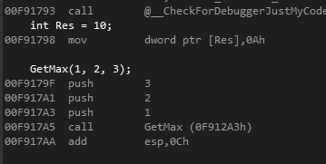

# 컴파일러 최적화(좋은 코드란?)
성능 향상 == CPU + 메모리 사용 감소 
따라서 과거에는 함수형 대신 매크로(Macro) 를 많이 사용함.
이후에 매크로의 단점을 보완하여 적용된 것이 inline 함수 (컴파일러가 기본적으로 설정함)

최적화의 주체 : Compiler
Compiler 를 돕는 코드 : 좋은 코드

---

# inline 함수
inline 함수 : 매크로의 장점을 그대로 살리면서도 매개변수의 자료형 문제, 괄호 문제, 지역변수, 제어문 문제 등 다양한 문법적 단점을 극복

---

# 함수 호출 규칙
- 매개변수를 전달하는 순서 및 매개변수가 사용한 메모리 관리방법 등에 관한 규칙
- __Call Stack__ : 함수가 메모리에서 저장되는 방식 (__스택__ 자료구조) 이다. 
함수가 종료된 후에는 함수를 가리키던 포인터가 호출 지점으로 다시 돌아가게 되는데 이를 __"자동 변수"__ 라고 한다.

## cdecl, stdcall, fastcall

|  호출 규칙 | 매개변수 스택 정리 |  매개변수 메모리 |
|:----------:|:------------------:|:----------------:|
|   __cdecl  |       Caller       |       Stack      |
|  __stdcall |       Callee       |       Stack      |
| __fastcall |       Callee       | Stack + Register |

- 매개변수 스택 정리 : 함수가 종료될 때 스택에 있던 매개변수를 정리하는 주체가 누구인가?
- 매개변수 메모리 : 함수 실행에 필요한 매개변수를 어디에 할당하는가?

### __cdecl

```c
#include<stdio.h>

int __cdecl GetMax(int a, int b, int c) {
	int Max = a;
	if (b > Max) Max = b;
	if (c > Max) Max = c;

	return Max;
}

int main(void) {
	int Res = 10;

	GetMax(1, 2, 3);

	return 0;
}
```

위 코드를 빌드하고 Max 변수를 선언하는 곳과 return 지점에 중단점을 두고 디버그를 한다.


그리고 주소 입력란에 __&Max__ 를 쳐서 Max 변수의 메모리 위치로 이동하고 계속 실행하면 Max 위치에 3 이 입력되는 것을 볼 수 있다.


메모리 창에서 Max 값이 3 으로 입력되는 곳까지가 GetMax 함수의 영역임을 알 수 있다. Max 위치에서 좀 아래를 보면 1, 2, 3 이 저장되어 있는 것을 볼 수 있다. 즉, 매개변수들이다. 우리의 예상과는 다르게 1,2,3 이 아니라 3,2,1 순서로 저장되어있다. 따라서 __함수가 호출될 때 스택에 저장되는 매개변수는 우리가 보는 순서의 역순으로 저장된다는 것을 알 수 있다.__

그리고 디스어셈블 창을 보면 cdecl 호출 방식의 특징을 볼 수 있다.



```
	GetMax(1, 2, 3);
00F9179F  push        3  
00F917A1  push        2  
00F917A3  push        1  
00F917A5  call        GetMax (0F912A3h)  
00F917AA  add         esp,0Ch  
```

main 함수에서 GetMax 를 호출하는 부분의 어셈블리 코드이다. GetMax 를 호출하고 esp 값에 10진수로 12 를 더한다. 여기서 __ESP__ 란 메모리에서 함수를 가리키는 Stack Pointer 를 뜻한다. Stack Pointer 값에 12 만큼 더해주어 GetMax 함수가 종료되고 메모리에 할당된 공간을 해제하는 부분이다. 여기서 왜 12 인가 의문점이 들 수 있다. 0x0C, 12 는 매개변수의 크기를 뜻한다. GetMax 함수의 매개변수 값은 __int__ 형 변수 3개가 필요하기 때문에 4*3 = 12 byte 가 필요하다. 따라서 GetMax 함수는 호출될 때 __Stack__ 영역에 저장되며 함수가 종료되고 __main 함수에서__ ESP 값을 매개변수들의 공간만큼 더해주어 스택 공간을 해제한다. (ESP 값은 레지스터 영역에 저장된다.)

### __stdcall

```c
#include<stdio.h>

int __stdcall GetMax(int a, int b, int c) {
	int Max = a;
	if (b > Max) Max = b;
	if (c > Max) Max = c;

	return Max;
}

int main(void) {
	int Res = 10;

	GetMax(1, 2, 3);

	return 0;
}
```

이번에는 stdcall 을 cdecl 방식의 코드를 분석할 때와 똑같은 방법으로 살펴본다.
다만 메모리에 저장되는 순서는 똑같기 때문에 이번에는 어셈블리 코드만 비교 해보도록 한다.


```
	GetMax(1, 2, 3);
00D5179F  push        3  
00D517A1  push        2  
00D517A3  push        1  
00D517A5  call        GetMax (0D51370h) 
```

cdecl 방식과 다르게 main 함수 안에서 esp 값을 더하던 코드가 없음을 확인할 수 있다.


```
	return Max;
00D5172A  mov         eax,dword ptr [Max]  
}
00D5172D  pop         edi  
00D5172E  pop         esi  
00D5172F  pop         ebx  
00D51730  add         esp,0CCh  
00D51736  cmp         ebp,esp  
00D51738  call        __RTC_CheckEsp (0D51208h)  
00D5173D  mov         esp,ebp  
00D5173F  pop         ebp  
00D51740  ret         0Ch  
```

GetMax 함수의 반환 부분을 어셈블리 코드로 보면 매개변수 정리하는 부분을 확인 할 수 있다.
즉, stdcall 방식은 __Callee 에서 매개변수 스택을 정리__ 한다.

### __fastcall

```c
#include<stdio.h>

int __fastcall GetMax(int a, int b, int c) {
	int Max = a;
	if (b > Max) Max = b;
	if (c > Max) Max = c;

	return Max;
}

int main(void) {
	int Res = 10;

	GetMax(1, 2, 3);

	return 0;
}
```

위 코드를 디버그하고 어셈블리 코드를 살펴본다.


```
	GetMax(1, 2, 3);
0012179F  push        3  
001217A1  mov         edx,2  
001217A6  mov         ecx,1  
001217AB  call        GetMax (0121375h)  
```

위 두 개의 호출 방식과 다르게 매개변수 3 개 중에서 __하나는 스택 영역에 저장하고 나머지 두 개는 레지스터 영역에 저장__ 하는 것을 확인 할 수 있다. 레지스터 영역을 사용하기 때문에 __더 빠르게__ 데이터를 사용할 수 있다. 그러면 fastcall 은 언제 사용해야 할까? 이러한 의문은 __컴파일러가 알아서 해주기 때문에 개발자가 따로 고민할 필요가 없다.__

---

# 함수 포인터와 역호출 구조

## 함수 포인터

- 포인터 : 주소저장 형식이며, __포인터가 가리키는 데이터가 무엇인지__ 중요하다. 주소 형식 중에는 __함수형__ 이 존재하며, __함수명이 곧 함수의 주소__ 이다.

```c
#include<stdio.h>

int main(void) {
	
	void* pData = main;

	printf("%p\n", pData);
	printf("%p\n", main);

	return 0;
}
```


함수명이 주소인 것을 알 수 있다 또다른 예제가 다음과 같다.

```c
#include<stdio.h>

int TestFunc(char *pParam) {
	return 0;
}

int main(void) {
	char ch = 'a';
	char* pCh = &ch;

	TestFunc(pCh);

	int data = (int)TestFunc;

	((int(*)(char*))data)(pCh);

	return 0;
}
```

위 코드를 실행하면 문제 없이 실행된다. 따라서 __함수의 문법 구조__ 는 정확히 다음과 같다.

```c
(반환형)    (*이름)     (매개변수형)

int         TestFunc    (char* pParam)
```

더 나아가서 __함수 포인터를 매개변수로 하는 함수__ 를 만들 수 있다.

```c
#include<stdio.h>

int TestFunc(char *pParam) {
	return 0;
}

void MyTest(int(*pfTest)(char*), int param) {

}

int main(void) {
	MyTest(TestFunc, 10);

	return 0;
}
```

## 함수 역호출 구조
- __qsort__ 함수를 보면 함수 역호출 구조를 알 수 있다.


```c
#include<stdio.h>
#include<stdlib.h>

int MyCmp(const void* left, const void* right) {
	return *(int*)left - *(int*)right;
}

int main(void) {
	int list[5] = { 20, 50, 10, 30, 40 };

	qsort(list, 5, sizeof(int), MyCmp);

	for (int i = 0; i < 5; i++)
		printf("%d\t", list[i]);
}
```

main 함수에서 호출한 __qsort 함수가 MyCmp 함수를 호출__ 한다.
qsort 함수가 MyCmp 함수를 몇 번 호출 할지는 모른다. 하지만 MyCmp 의 __함수 주소를 등록__ 하여 qsort 가 필요할 때마다 MyCmp 함수 주소를 통해 함수를 호출한다.

#### qsort 함수는 왜 CallBack 으로 만들었을까?
qsort 함수는 정렬 알고리즘을 구현한 것으로 __어떤 값(자료형)들을 비교하는지 모르기 때문에__ CallBack 함수로 구현하였다.

#### 함수포인터 와 배열을 이용하여 switch-case 구문 대체하기

```c
#include<stdio.h>

void TestFunc1(int param) {
	puts("TestFunc1");
}

void TestFunc2(int param) {
	puts("TestFunc2");
}

void TestFunc3(int param) {
	puts("TestFunc3");
}
int main(void) {
	void(*pFuncList[3])(int) = {
		TestFunc1, TestFunc2, TestFunc3
	};

	int input;
	scanf_s("%d", &input);
	pFuncList[input](10);

	return 0;
}
```

---

# 정적 라이브러리의 구현
- 라이브러리 : 가장 많이 재사용되는 함수들의 묶음
- __코드 재사용을 효율적__ 으로 하기 위해 사용된다.
- __링크__ 과정에서 사용된다.
- `.lib` 가 확장자이며 `.obj` 와 비슷하다.

## 예제 만들기
1. Visual Studio 에서 솔루션을 하나 만든다. (콘솔 앱 or 정적 라이브러리)

2. 콘솔 앱 프로젝트를 만들었다면 정적 라이브러리 프로젝트를 만든다. 반대의 경우엔 반대로 만든다.
단, 새 프로젝트를 만드는 것이 아니라 __솔루션에 추가__ 설정을 한다.

3. 정적 라이브러리 예제 코드는 다음과 같다.

```c
#include<stdio.h>

void PrintValue(int val) {
	printf("PrintValue() : %d\n", val);
}

void PrintString(const char* str) {
	printf("PrintString() : %s\n", str);
}
```

4. 콘솔 앱에 있는 메인 함수 코드는 다음과 같다.

```c
#include<stdio.h>

void PrintValue(int);
#pragma comment(lib, ".\\Debug\\LibTest.lib")

int main(void) {
	PrintValue(10);

	return 0;
}
```

```c
void PrintValue(int);
#pragma comment(lib, ".\\Debug\\LibTest.lib")
```

전처리 부분에서 두 줄이 반드시 같이 있어야 하며 경로는 __lib 파일이 있는 경로__ 를 입력한다.

## 하지만 위 코드는 너무 불편하다.

따라서 헤더파일로 만들어서 사용할 수 있다. 헤더 파일을 정적 라이브러리 프로젝트에 추가한다.

```c
#pragma once

void PrintValue(int);
#pragma comment(lib, ".\\Debug\\LibTest.lib")
```

```c
#include<stdio.h>
#include "..\\LibTest\\LibTest.h"

int main(void) {
	PrintValue(10);

	return 0;
}
```

main 함수 안에서 include 를 한 줄만 작성하면 되기 때문에 더 효율적이다.
정적 라이브러리를 사용하면 __함수 재사용을 정말 편하게 할 수 있다.__